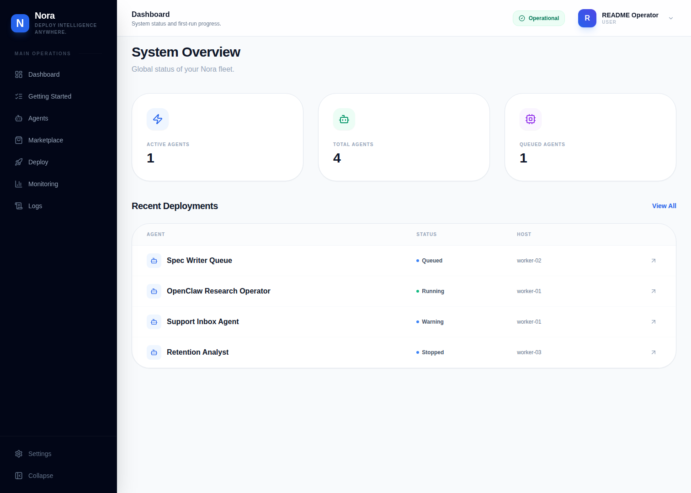
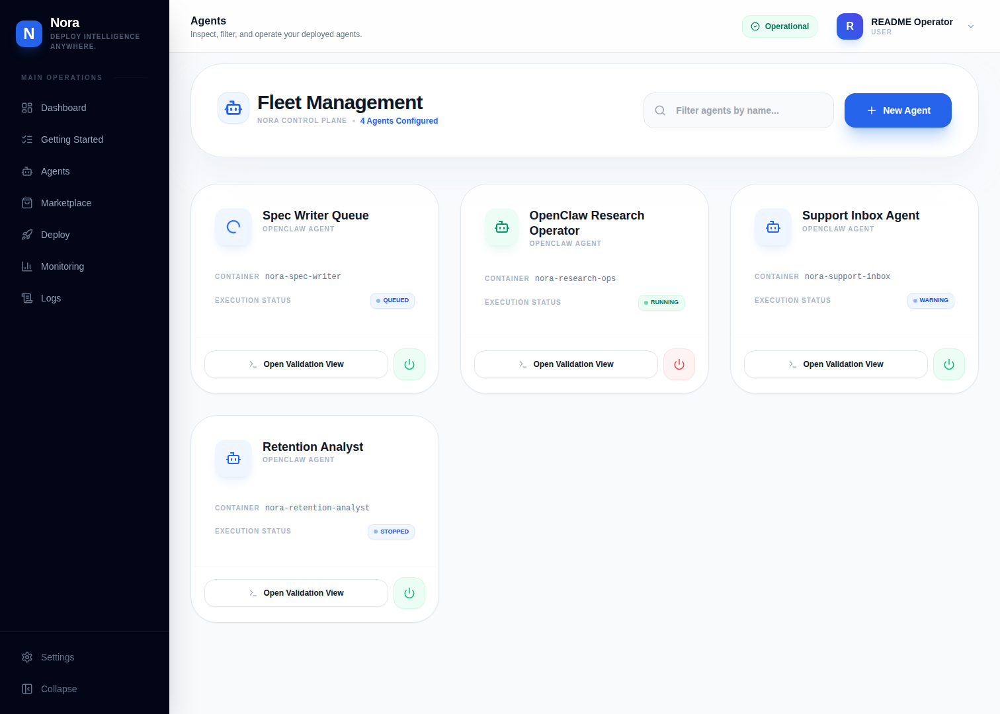
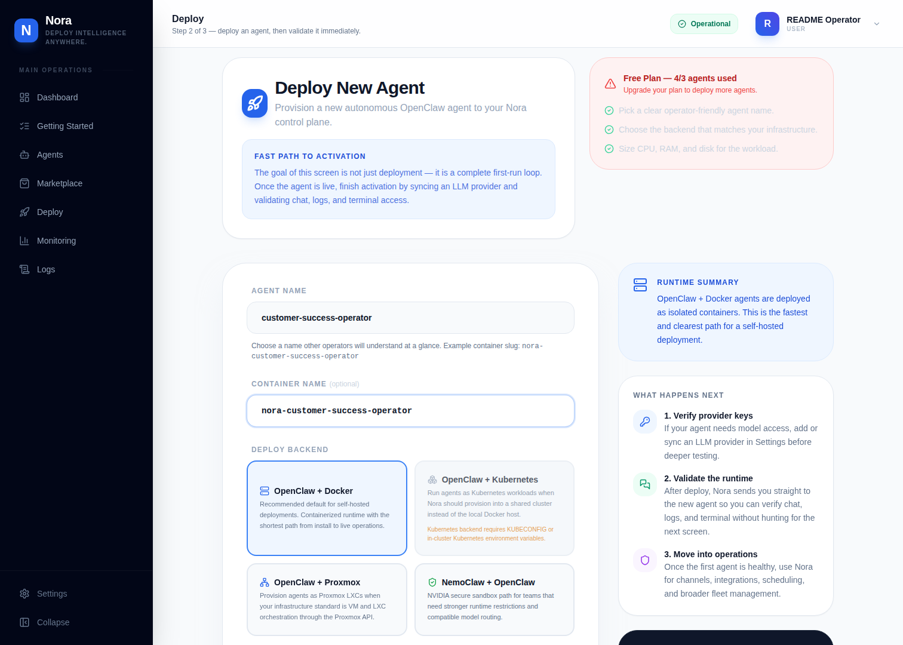
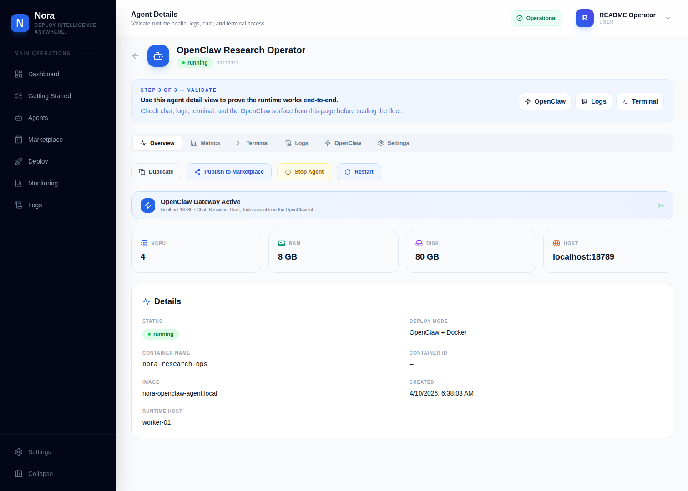
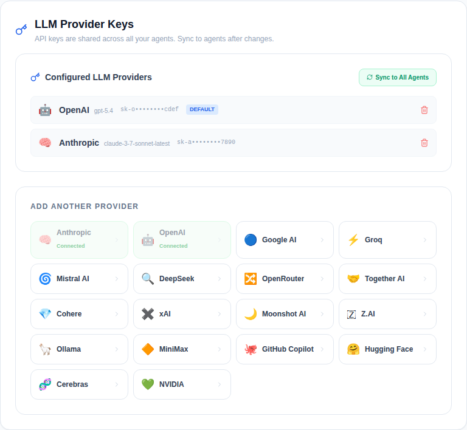
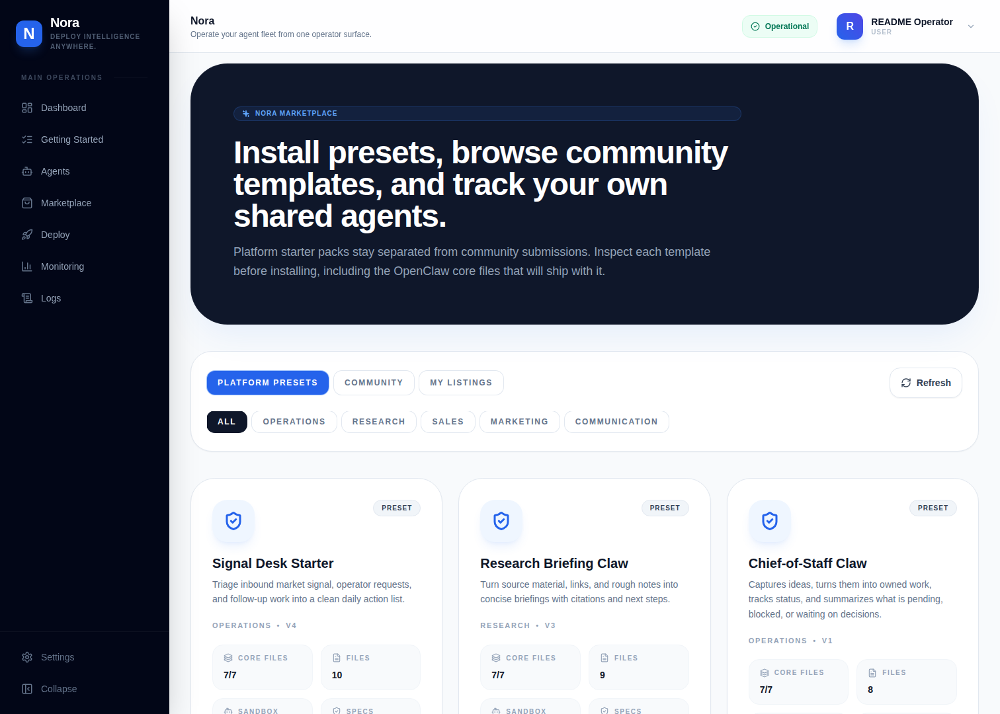
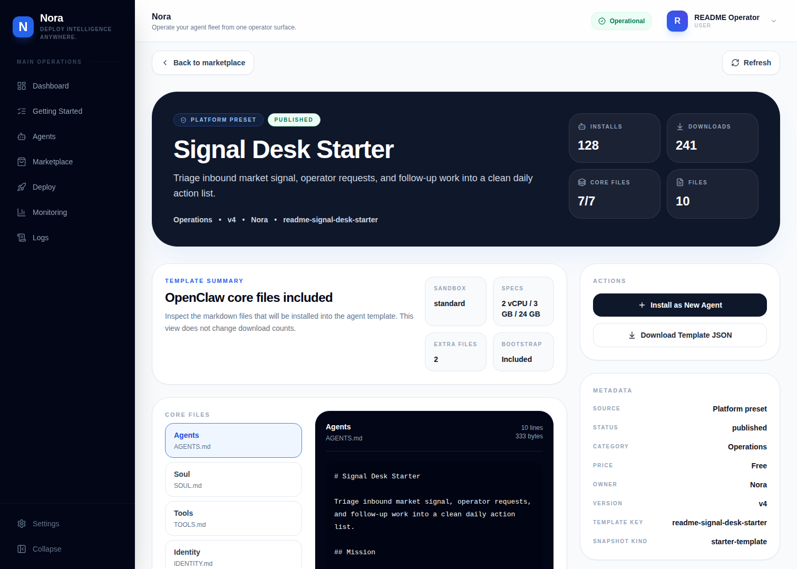
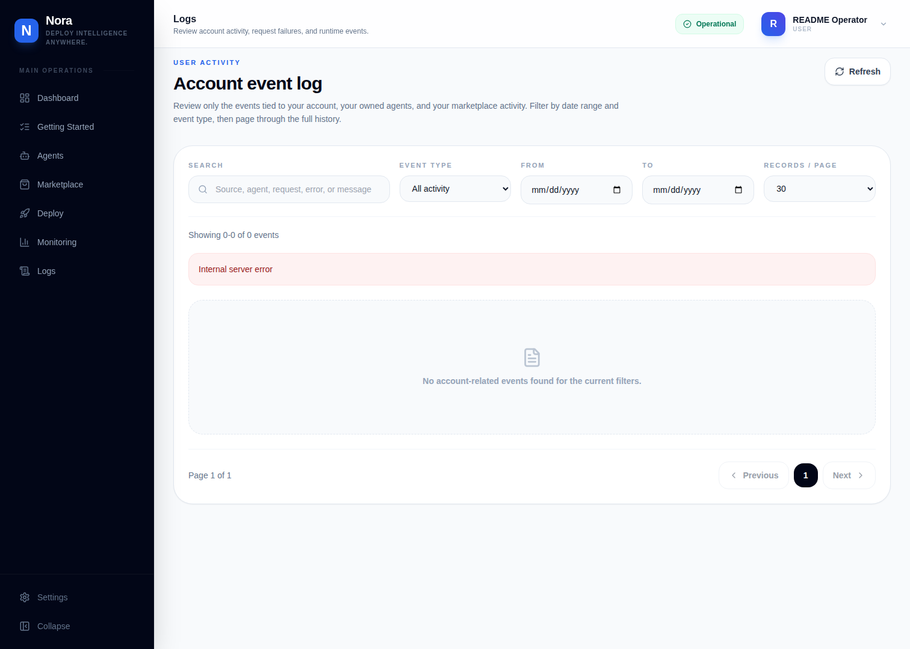
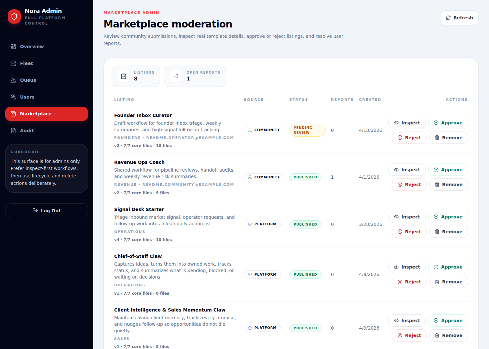
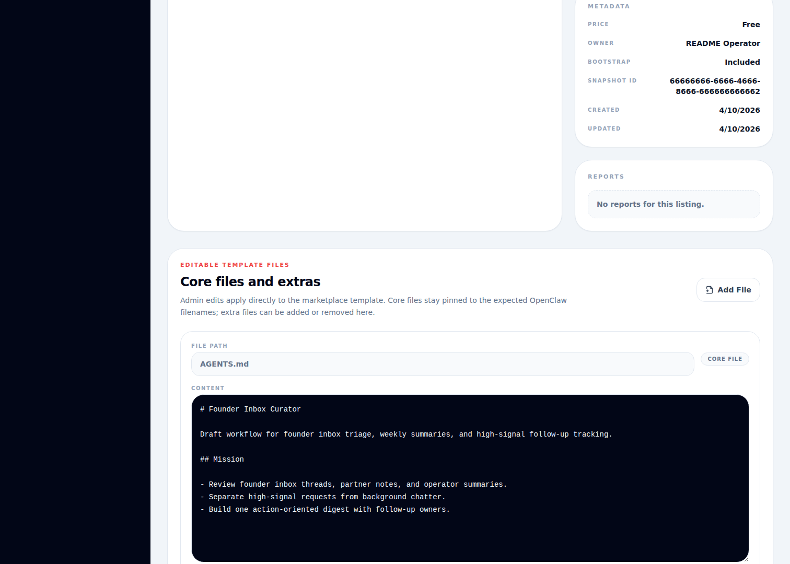

<p align="center">
  <h1 align="center">Nora</h1>
  <p align="center"><strong>The open-source control plane for AI agent operations.</strong></p>
  <p align="center">Deploy, observe, and operate agent runtimes across Docker, Proxmox, Kubernetes, and NemoClaw — from a single self-hosted surface.</p>
</p>

<p align="center">
  
  
  
  
  
</p>

<p align="center">
  <a href="#quick-start">Quick Start</a> ·
  <a href="#why-nora">Why Nora</a> ·
  <a href="#features">Features</a> ·
  <a href="#runtime-model">Runtime Model</a> ·
  <a href="#architecture">Architecture</a> ·
  <a href="#how-nora-compares">Comparisons</a> ·
  <a href="#roadmap">Roadmap</a> ·
  <a href="#contributing">Contributing</a>
</p>

---

## Why Nora?

Agent runtimes like OpenClaw are powerful — but deploying them safely at scale is still a DIY problem. Every team ends up building the same infrastructure: key management, isolated environments, fleet monitoring, lifecycle controls, and an admin surface.

Nora is the operator layer that sits above agent runtimes. It handles the deployment, observability, and operational workflows so you can focus on what your agents actually do.

- **Deploy agents into isolated environments** with defined CPU, RAM, and disk limits
- **Manage provider keys centrally** and sync them to running runtimes (encrypted with AES-256-GCM)
- **Monitor fleet health** with account-scoped event logs, runtime metrics, and admin audit views
- **Install or publish marketplace templates** to standardize agent configurations across your fleet
- **Access chat, logs, and terminal** for every agent from one dashboard
- **Self-host everything** — the repo, install scripts, and Docker Compose flow are the trust path

> **If other tools help you *build* agents, Nora helps you *run* them.**

---

## Quick Start

### One-line install

**macOS / Linux / WSL2**

```bash
curl -fsSL https://raw.githubusercontent.com/solomon2773/nora/master/setup.sh | bash
```

**Windows (PowerShell)**

```powershell
iwr -useb https://raw.githubusercontent.com/solomon2773/nora/master/setup.ps1 | iex
```

The installer clones the repo, verifies Docker and OpenSSL, generates secrets, creates your admin account, and starts the stack. You'll be at the dashboard in under five minutes.

### Manual setup

```bash
git clone https://github.com/solomon2773/nora.git
cd nora
cp .env.example .env    # edit with your secrets
docker compose up -d
```

### First deployment

1. Open `localhost:8080/app/dashboard`
2. Go to **Settings** → save an LLM provider key (Anthropic, OpenAI, Google, etc.)
3. Go to **Deploy** → name your agent → choose runtime → set resources → deploy
4. Verify via **Chat**, **Logs**, and **Terminal** from the agent detail page

That's it. One provider key, one deploy, and you have a running agent with full operator controls.

| URL | What |
|---|---|
| `localhost:8080` | Landing page |
| `localhost:8080/login` | Login |
| `localhost:8080/signup` | Create operator account |
| `localhost:8080/app/dashboard` | System overview |
| `localhost:8080/app/deploy` | Deploy your first agent |

---

## Runtime Model

### OpenClaw-first, runtime-friendly by design

[OpenClaw](https://github.com/openclaw/openclaw) is the default runtime — the fastest way to go from install to a live agent. But Nora's architecture is built around clean runtime abstractions, not a single runtime dependency.

**Supported backends today:**

| Backend | Status | What it provides |
|---|---|---|
| **Docker** | Stable | Container-isolated OpenClaw instances with resource limits |
| **NemoClaw** | Supported | NVIDIA OpenShell sandboxing with Landlock, seccomp, and network namespace isolation |
| **Kubernetes** | Supported | Orchestrated deployments for larger fleet operations |
| **Proxmox** | Supported | VM-level isolation for private fleet control |

**Planned runtime expansion:**

- **Generic container runtime** — deploy any Docker image (LangGraph apps, CrewAI crews, custom Python agents) as a managed agent with the same operator controls
- **Coding agent runtimes** — sandboxed environments for Claude Code, Codex, and similar coding agents
- **Local inference runtimes** — Ollama and vLLM integration for teams that need fully local model execution
- **Runtime adapter SDK** — a clean interface for community-built runtime adapters

The goal: Nora manages *any* agent runtime the same way — deploy, monitor, sync keys, access logs — regardless of what's running inside the container.

### Why this matters now

OpenClaw's explosive growth (196k+ GitHub stars) has created real demand for operator infrastructure. At the same time, the security landscape is serious — supply chain attacks on skills marketplaces, exposed gateway endpoints, and the need for isolated deployment environments are driving teams toward exactly the kind of controlled operator surface Nora provides.

Nora turns those security requirements into product features: isolated environments, encrypted key management, fleet-wide audit logs, and admin controls are built in from the start.

---

## Features

### Deploy & manage agents

Create agents, choose the runtime backend, define resource limits (CPU, RAM, disk), and manage their full lifecycle from the operator dashboard.

### Chat, logs & terminal

Interact with agents via built-in chat, inspect runtime logs in real time, and open persistent terminal sessions — all from the same surface.

### Provider key management

Store API credentials centrally with AES-256-GCM encryption. Sync keys to running runtimes on demand. Rotate credentials fleet-wide from one place.

### Marketplace

Browse platform presets, install community templates as new agents, or publish your own. Templates package the OpenClaw core files (`AGENTS.md`, `SOUL.md`, `TOOLS.md`, `IDENTITY.md`, `USER.md`, `HEARTBEAT.md`, `MEMORY.md`) plus optional extras like `BOOTSTRAP.md`.

### Monitoring & event log

Users see their own agents, installs, submissions, and runtime events. Admins get platform-wide fleet, user, queue, and audit views.

### Operator / admin split

Operator workspace (`/app`): agents, marketplace, logs, monitoring, settings. Admin workspace (`/admin`): fleet overview, user management, audit, queue workflows, marketplace moderation with editable core files and template metadata.

### Channels & integrations

Configure communication channels and connect external integrations from the operator control plane.

---

## Product Tour

Screenshots captured from the current local Nora stack.

### Operator workspace

| | |
|---|---|
|  **System overview** |  **Fleet management** |
|  **Deploy flow** |  **Agent detail** |
|  **Provider setup** |  **Marketplace** |
|  **Template detail** |  **Event log** |

### Admin workspace

| | |
|---|---|
|  **Marketplace moderation** |  **Template editor** |

---

## How Nora Compares

Nora is an **operator control plane** — it deploys and manages the infrastructure that agent runtimes run on. It's not an agent builder, a governance policy engine, or a single-instance hosting provider.

| Project | What it does | How Nora differs |
|---|---|---|
| **ClawHost / OneClaw / Kimi Claw** | One-click OpenClaw hosting on a single VPS | Nora manages fleets across multiple backends, not single instances |
| **NemoClaw** (NVIDIA) | Sandboxed OpenClaw runtime with OpenShell security | Nora uses NemoClaw as a backend — it's the management layer above it |
| **Agent Control** (Galileo) | Runtime policy enforcement and governance | Nora handles the full operator lifecycle; governance is one layer within that |
| **Dify** | Low-code agent/RAG app builder | Builds agent logic; Nora deploys and operates the infrastructure agents run on |
| **CrewAI** | Multi-agent orchestration framework | Defines agent roles and pipelines; Nora manages the runtimes underneath |
| **Sim Studio** | Visual agent workflow canvas | Designs agent workflows; Nora deploys and monitors the running result |
| **Langfuse** | LLM observability and tracing | Traces model calls; Nora manages the infrastructure those calls happen within |
| **Paperclip** | Autonomous business orchestration | Org-level agent coordination; Nora is the infrastructure layer underneath |

---

## Architecture

```text
Nginx (:8080)
├── /           → frontend-marketing   (Next.js)
├── /app/*      → frontend-dashboard   (Next.js)
├── /admin/*    → admin-dashboard      (Next.js)
└── /api/*      → backend-api          (Express.js)
                      ├── PostgreSQL 15
                      ├── Redis 7 + BullMQ
                      └── Runtime adapters
                            ├── Docker
                            ├── NemoClaw / OpenShell
                            ├── Kubernetes
                            └── Proxmox
```

### Tech stack

| Layer | Technology |
|---|---|
| Reverse proxy | Nginx |
| Frontend | Next.js 14, React 18, Tailwind CSS |
| Backend | Express.js 4, Node.js 20 |
| Auth | NextAuth.js, JWT, bcryptjs |
| Database | PostgreSQL 15 |
| Queue | BullMQ + Redis 7 |
| Agent runtime | OpenClaw Gateway (default), extensible via runtime adapters |
| Encryption | AES-256-GCM |
| Provisioning | Docker, Proxmox, Kubernetes, NemoClaw |

### Project structure

```
nora/
├── frontend-marketing/      Landing, login, signup, pricing
├── frontend-dashboard/      Operator workspace
├── admin-dashboard/         Admin surfaces
├── backend-api/             APIs, auth, provisioning, marketplace
├── agent-runtime/           Runtime configuration
├── workers/provisioner/     Background provisioning jobs
├── e2e/                     Playwright end-to-end tests
└── infra/                   Backup, TLS, nginx templates
```

---

## Deployment Targets

| Environment | Use case |
|---|---|
| **Single host** | Solo developers, small teams, local testing |
| **Proxmox** | Stronger VM-level isolation, private fleet control |
| **Private cloud / on-prem** | Security-conscious internal platforms |
| **AWS / Azure / GCP** | Cloud-native and enterprise rollouts |

Nora starts as a single Docker Compose stack and scales into serious infrastructure without changing the operator workflow.

---

## Configuration

### Required

| Variable | Description |
|---|---|
| `JWT_SECRET` | 64-char hex key for JWTs (`openssl rand -hex 32`) |
| `ENCRYPTION_KEY` | 32-byte hex key for AES-256-GCM |
| `NEXTAUTH_URL` | Base browser URL (e.g. `http://localhost:8080`) |

### Optional

| Variable | Default | Description |
|---|---|---|
| `PLATFORM_MODE` | `selfhosted` | `paas` to run Nora as your own hosted platform |
| `ENABLED_BACKENDS` | `docker` | Comma-separated: `docker`, `k8s`, `proxmox`, `nemoclaw` |
| `NGINX_CONFIG_FILE` | `nginx.conf` | `nginx.public.conf` for public-domain mode |
| `NGINX_HTTP_PORT` | `8080` | `80` for public deployments |
| `K8S_EXPOSURE_MODE` | `cluster-ip` | `node-port` for local Kind verification |
| `NVIDIA_API_KEY` | — | Required when backends include `nemoclaw` |
| `CORS_ORIGINS` | — | Comma-separated allowed origins |

### TLS

```bash
DOMAIN=yourdomain.com EMAIL=admin@yourdomain.com ./infra/setup-tls.sh
```

### OAuth & billing (optional)

Google and GitHub OAuth, plus Stripe billing for PaaS mode, are configured via `.env`. See `.env.example` for all available variables.

---

## Usage Modes

### Self-hosted (default)

Clone the repo, run the installer, own your infrastructure. This is the primary path.

### PaaS mode

Set `PLATFORM_MODE=paas` to operate Nora as your own hosted product or internal platform. Billing, plans, onboarding, and infrastructure stay under your control.

### Build on top

Apache 2.0 means you can package Nora, host it for clients, extend it with custom integrations, and use it commercially. No maintainer-commercial relationship required.

---

## Development

```bash
# Docker (recommended)
docker compose up -d
docker compose logs -f backend-api
docker compose up -d --build backend-api

# Local dev
cd backend-api && npm install && npm run dev
cd frontend-dashboard && npm install && npm run dev
cd frontend-marketing && npm install && npm run dev

# Tests
cd backend-api && npx jest --no-watchman

# E2E (requires docker, kind, kubectl)
cd e2e && npm run smoke:k8s-kind

# Database
docker compose exec postgres psql -U platform -d platform
```

For Kubernetes verification, use [`docker-compose.kind.yml`](docker-compose.kind.yml) which sets `ENABLED_BACKENDS=k8s` and `K8S_EXPOSURE_MODE=node-port`.

For public-domain setup, use [`infra/nginx_public.conf.template`](infra/nginx_public.conf.template) for plain HTTP or [`infra/setup-tls.sh`](infra/setup-tls.sh) for Let's Encrypt TLS.

---

## Roadmap

### Now

- Activation UX and first-run operator flow
- Self-hosted documentation and deployment guides
- Marketplace publishing, inspection, and moderation flows
- Account-scoped monitoring and onboarding clarity
- Auth, key sync, and operator workflow hardening

### Next

- Public REST API and API keys
- Generic container runtime adapter (deploy any Docker image as a managed agent)
- Multi-tenant teams with RBAC
- Agent versioning and rollback
- CLI for deployment and sync

### Later

- Runtime adapter SDK for community-built integrations
- Coding agent runtime support
- Local inference runtime integration (Ollama, vLLM)
- Alerting and cost controls
- Fleet-wide credential rotation workflows

---

## Contributing

Nora is in active development. Good areas to contribute:

- Frontend UX for operator workflows
- Backend provisioning and lifecycle management
- Runtime adapter development
- Testing and CI hardening
- Integrations and channel support
- Self-hosted deployment ergonomics

```bash
git checkout -b feature/your-feature
# make changes, commit, open a PR
```

---

## Community

- [Issues](https://github.com/solomon2773/nora/issues)
- [Discussions](https://github.com/solomon2773/nora/discussions)
- [OpenClaw](https://github.com/openclaw/openclaw)

---

## License

[Apache License 2.0](LICENSE) — self-host it, modify it, use it commercially.