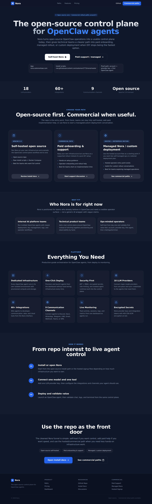

<p align="center">
  <h1 align="center">Nora</h1>
  <p align="center"><strong>The open-source control plane for agent operations.</strong></p>
  <p align="center">Deploy, observe, and operate agent runtimes from one dashboard. OpenClaw is the strongest supported runtime today, while Nora stays aimed at broader runtime integration over time.</p>
</p>

<p align="center">
  
  
  
  
  
</p>

<p align="center">
  <a href="https://github.com/solomon2773/nora#quick-start">Quick Start</a>
  ·
  <a href="https://nora.solomontsao.com">Live app / hosted eval / managed path</a>
  ·
  <a href="https://nora.solomontsao.com/pricing">Pricing + commercial paths</a>
  ·
  <a href="https://github.com/solomon2773/nora/discussions">Paid rollout help</a>
  ·
  <a href="https://raw.githubusercontent.com/solomon2773/nora/master/setup.sh">Install script (bash)</a>
  ·
  <a href="https://raw.githubusercontent.com/solomon2773/nora/master/setup.ps1">Install script (PowerShell)</a>
  ·
  <a href="#open-source-proof-pack">Open-source proof pack</a>
  ·
  <a href="#screenshots">Screenshots</a>
  ·
  <a href="#runtime-direction">Runtime direction</a>
</p>

<p align="center">
  
</p>

---

## What is Nora?

Nora is an open-source control plane for self-hosted agent operations.

Today, the best-supported path is [OpenClaw](https://github.com/openclaw/openclaw). That is the clearest way to evaluate Nora right now. But the product direction should stay broader than a single runtime: Nora should become easier to integrate with additional agent runtimes over time.

Nora gives technical teams a single place to:

- deploy agent runtimes into isolated environments
- manage provider keys and sync them to running runtimes
- access chat, logs, and terminal workflows
- connect channels and integrations
- monitor operator activity and runtime workflows

The core value proposition is simple: **if you care about infrastructure, observability, repeatable operations, and a trustworthy operator surface, Nora helps you get to a usable control plane faster.**

## Open source means open source

Nora is licensed under **Apache 2.0**.

That means you can:

- self-host Nora on your own infrastructure
- modify the codebase for your own needs
- use Nora commercially inside your company
- host Nora for clients or customers on infrastructure you control
- build services, packaging, or integrations on top of Nora

The repo should not market a maintainer-commercial relationship as the center of the product. The center of the product is the **fully open-source repo and self-hosted control-plane workflow**.

## Current product direction

### OpenClaw-first today

OpenClaw is the most mature and best-supported runtime path in Nora today. If you want the fastest proof of value, start there.

### Not OpenClaw-only forever

Nora should not be permanently framed as useful only for OpenClaw. The product, docs, and interface should stay friendly to future integration with other agent runtimes.

That means:

- avoid branding the whole product as permanently single-runtime
- describe OpenClaw as the strongest supported path **today**
- keep runtime abstractions clean enough that future adapters are realistic
- show examples with OpenClaw now without turning the platform story into “OpenClaw only, forever”

## Who Nora is for

Nora is best for:

- internal AI platform teams
- technical product teams
- ops-minded operators running agent infrastructure
- service providers who want to host and operate agent control planes for others

Nora is not trying to be:

- a vague “AI workforce” shell
- a generic low-code automation toy
- a closed wrapper around an otherwise-open repo

## Fastest path to proof

Use this path to reach first proof of value quickly:

1. **Install Nora** with the setup script or Docker Compose flow
2. **Create your operator account** and save one LLM provider key
3. **Deploy one agent runtime** and validate chat, logs, and terminal from the same surface

That path is still easiest with OpenClaw today, but the operator model should remain extensible.

## Open-source proof pack

Nora should ask people to trust the product itself, the install path, and the operator workflow.

Use these resources when you need to prove that the repo is real and usable:

- [Open-source implementation proof](docs/IMPLEMENTATION_PROOF.md) — code-backed evidence for self-hosting, operator flows, and runtime direction
- [Adoption checklist](docs/ADOPTION_CHECKLIST.md) — practical paths for self-hosting, Apache 2.0 commercial use, and runtime expansion
- [Open-source usage guide](docs/OPEN_SOURCE_USAGE.md) — Apache 2.0 usage rights and public repo framing
- [README screenshot plan](docs/README_SCREENSHOT_PLAN.md)
- [Marketing proof asset plan](docs/MARKETING_PROOF_ASSET_PLAN.md)
- [Operator screenshot capture script](e2e/scripts/capture-operator-screenshots.mjs) — regenerates the operator screenshots from a local self-hosted stack

## Screenshots

The repo now includes real operator-side screenshots alongside the marketing and OSS-proof images. They show Nora as a working self-hosted control plane, with OpenClaw as the current best-supported runtime example rather than the forever-only frame.

### Landing and OSS proof

<p align="center">
  
</p>

<p align="center">
  
</p>

<p align="center">
  
</p>

### Operator overview and fleet

<p align="center">
  
</p>

<p align="center">
  
</p>

### Deploy and validate

<p align="center">
  
</p>

<p align="center">
  
</p>

### Provider setup

<p align="center">
  
</p>

## Runtime direction

Nora should be described as:

- **OpenClaw-first today**
- **runtime-friendly by direction**
- **self-hosted and commercially usable by anyone under Apache 2.0**

That framing is more durable than treating Nora as a permanently single-runtime dashboard or centering the repo around sales packaging.

## Quick Start

### Prerequisites

> The setup script can install Docker, Docker Compose, and Git if they are missing.

- macOS 12+, Linux (Ubuntu 20.04+, Debian 11+, Fedora 38+), or Windows 10+ with WSL2
- Admin/sudo access for initial setup

### Recommended install

**macOS / Linux / WSL2**

```bash
curl -fsSL https://raw.githubusercontent.com/solomon2773/nora/master/setup.sh | bash
```

**Windows (PowerShell)**

```powershell
iwr -useb https://raw.githubusercontent.com/solomon2773/nora/master/setup.ps1 | iex
```

The installer will:

1. clone the repository
2. verify Docker, Docker Compose, and OpenSSL
3. generate platform secrets
4. configure self-hosted or PaaS mode
5. create the initial admin account
6. collect an LLM provider key (optional but recommended)
7. start the Nora stack
8. take you to the dashboard so you can deploy the first agent

The public install links intentionally use `raw.githubusercontent.com` so the setup path stays aligned with the open-source repo and current trust model.

### Manual setup

```bash
git clone https://github.com/solomon2773/nora.git
cd nora
bash setup.sh
```

Or configure by hand:

```bash
cp .env.example .env
```

Then edit `.env` with your secrets:

```bash
# Required — generate with: openssl rand -hex 32
JWT_SECRET=your-64-char-hex-key
ENCRYPTION_KEY=your-64-char-hex-key

# Default admin account (created on first boot)
DEFAULT_ADMIN_EMAIL=admin@nora.local
DEFAULT_ADMIN_PASSWORD=changeme

# Optional — OAuth (leave blank to disable)
GOOGLE_CLIENT_ID=
GOOGLE_CLIENT_SECRET=
GITHUB_CLIENT_ID=
GITHUB_CLIENT_SECRET=
NEXTAUTH_SECRET=your-64-char-hex-key

# Optional — Stripe billing (PaaS mode)
STRIPE_SECRET_KEY=
STRIPE_PRICE_PRO=
STRIPE_PRICE_ENTERPRISE=
```

Start the stack:

```bash
docker compose up -d
```

---

## First 15 minutes with Nora

### 1) Open the dashboard

| URL | What |
|---|---|
| [localhost:8080](http://localhost:8080) | Marketing / entry page |
| [localhost:8080/login](http://localhost:8080/login) | Login |
| [localhost:8080/signup](http://localhost:8080/signup) | Create operator account |
| [localhost:8080/app/dashboard](http://localhost:8080/app/dashboard) | System overview |
| [localhost:8080/app/deploy](http://localhost:8080/app/deploy) | Deploy your first agent |

### 2) Add an LLM provider

Go to **Settings** and save an API key for a supported provider such as Anthropic, OpenAI, Google, or another available provider.

### 3) Deploy your first agent runtime (OpenClaw is the default path today)

1. Go to **Deploy**
2. enter an agent name
3. choose a runtime mode
4. size CPU, RAM, and disk
5. click **Confirm & Deploy Agent**

### 4) Validate the runtime

After deployment:

1. open the agent detail page
2. verify the agent is running
3. sync provider keys if needed
4. test **Chat**
5. inspect **Logs**
6. open **Terminal**

If those steps work cleanly, Nora has already demonstrated its core value.

---

## What you can do in Nora

### Deploy & Manage Agents

Create agents, choose the runtime backend, define resource limits, and manage their lifecycle from the dashboard.

### Chat with Agents

Use OpenClaw chat workflows directly from the UI with streaming responses and session visibility.

### Open Interactive Terminals

Access persistent terminal sessions connected to agent runtimes.

### Manage Provider Keys

Save provider credentials centrally and sync them to running agents when needed.

### Connect Channels & Integrations

Configure communication channels and browse integration options from the same control plane.

### Monitor Operations

Track agent health, queue state, logs, metrics, and runtime activity.

---

## Architecture

```text
  Nginx (:8080)
  ├── /           → frontend-marketing  (Next.js)
  ├── /app/*      → frontend-dashboard  (Next.js)
  ├── /admin/*    → admin-dashboard     (Next.js)
  └── /api/*      → backend-api         (Express.js)
                        ├── PostgreSQL 15
                        ├── Redis 7 + BullMQ
                        └── OpenClaw Gateway today / broader runtime adapters later
```

### Core components

- `frontend-marketing/` — landing, login, signup, usage-rights page
- `frontend-dashboard/` — operator dashboard for agents and settings
- `backend-api/` — APIs, auth, key management, provisioning, monitoring
- `admin-dashboard/` — admin/operator surfaces
- `e2e/` — Playwright end-to-end tests
- `infra/` — backup and TLS helpers

---

## Tech Stack

| Layer | Technology |
|---|---|
| Reverse Proxy | Nginx |
| Frontend | Next.js 14, React 18, Tailwind CSS |
| Backend | Express.js 4, Node.js 20 |
| Auth | NextAuth.js, JWT, bcryptjs |
| Database | PostgreSQL 15 |
| Queue | BullMQ + Redis 7 |
| Agent Runtime | OpenClaw Gateway today; broader runtime integrations remain in scope |
| Encryption | AES-256-GCM |
| Provisioning | Docker, Proxmox, Kubernetes, NemoClaw |

---

## Configuration

### Environment variables

| Variable | Required | Description |
|---|---|---|
| `JWT_SECRET` | Yes | Secret for signing JWTs |
| `ENCRYPTION_KEY` | Yes | 32-byte hex key (`openssl rand -hex 32`) |
| `PLATFORM_MODE` | No | `selfhosted` (default) or `paas` |
| `PROVISIONER_BACKEND` | No | `docker` (default), `proxmox`, `k8s` |
| `NEMOCLAW_ENABLED` | No | `true` to enable NemoClaw sandbox |
| `CORS_ORIGINS` | No | Comma-separated allowed origins |

---

## Development

```bash
# Docker (recommended)
docker compose up -d
docker compose logs -f backend-api
docker compose up -d --build backend-api

# Local dev
cd backend-api && npm install && npm run dev
cd frontend-dashboard && npm install && npm run dev
cd frontend-marketing && npm install && npm run dev

# Tests
cd backend-api && npx jest --no-watchman

# Database
docker compose exec postgres psql -U platform -d platform
```

For HTTPS/TLS setup, see [docs/HTTPS_SETUP.md](docs/HTTPS_SETUP.md).

---

## Roadmap

### Current focus

- improve activation UX and first-run operator flow
- tighten self-hosted positioning and documentation
- improve dashboard proof density and onboarding clarity
- continue hardening auth, key sync, and operator workflows

### Planned

- public REST API and API keys
- agent templates and cloning
- richer alerting and cost controls
- multi-tenant teams with stronger RBAC
- agent versioning and rollback
- CLI workflows for deployment and sync

---

## Contributing

Nora is in active development.

Good contribution areas include:

- frontend UX for operator workflows
- backend provisioning and lifecycle management
- testing and CI hardening
- integrations and channel support
- self-hosted deployment ergonomics

1. Fork the repository
2. Create your feature branch (`git checkout -b feature/amazing-feature`)
3. Commit your changes
4. Open a Pull Request

---

## Community

- [Issues](https://github.com/solomon2773/nora/issues)
- [Discussions](https://github.com/solomon2773/nora/discussions)
- [OpenClaw](https://github.com/openclaw/openclaw)

---

## License

This project is open source under the [Apache License 2.0](LICENSE).
